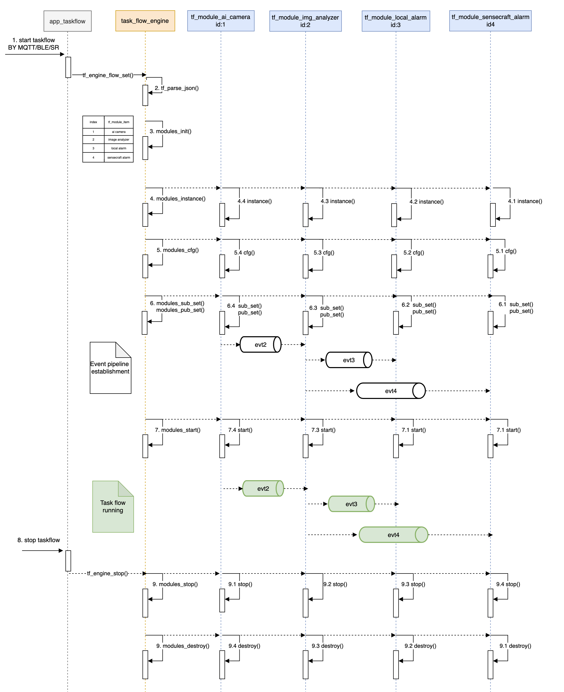
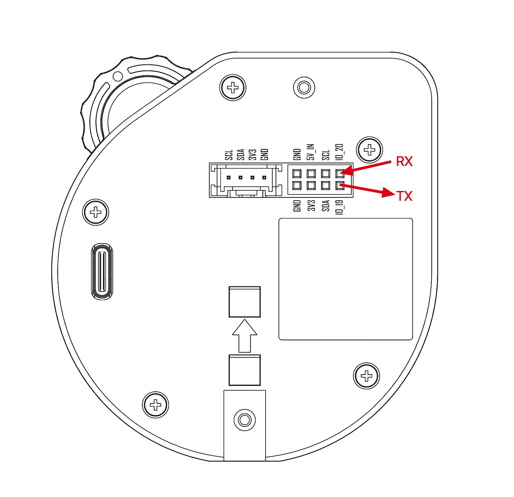

# 软件架构

SenseCAP Watcher的软件架构如下图所示, 主要分成三部分: APP应用程序、 UI及交互、任务流。


* APP应用程序: 主要是一些应用程序,如 WiFi连接、蓝牙配置、 与平台通信、OTA等, 同时会产生一些数据给UI显示.
* UI及交互: 主要是UI 界面和UI 交互的实现.
* 任务流: 主要是任务流引擎和各个任务流功能模块的实现.

## 1.任务流框架

### 1.1 概述

为了能满足各种场景需求，设计了一套类似于Node-RED功能的任务流框架， 能灵活的组织设备所具备的技能并能让它们相互运作起来.
我们把设备所具备的技能抽象成一个块, 然后这个块可能是数据生产者或者数据消费者, 或者即生产也消费数据. 然后根据具体的任务,提取出所需要运作的块，再通过生产消费的关系，把这些块连接起来, 以达到实现具体的场景任务.

### 1.2 任务流引擎

任务流引擎的主要作用根据任务流JSON能让各个功能模块运作起来; 它管理了功能模块的注册、功能模块的实例化和销毁、以及功能模块之间的连线.

如下图为任务流引擎的处理流程:


1. 初始化任务流引擎。
2. 将各个功能模块注册到任务流引擎中，使用链表存储各功能模块的管理函数和信息。
3. 任务流引擎等待接收任务流。
4. 接收到新任务流时，解析任务流JSON，提取所需运行的功能模块，存储在数组中。
5. 在功能模块数组中，根据模块名从链表中找到模块的管理函数，并进行排序。
6. 实例化功能模块。
7. 配置功能模块。
8. 建立功能模块之间的事件管道，用于消息传输。
9. 依次启动各个功能模块
10. 启动完成,任务流运行.

### 1.3 任务流JSON

任务流采用JSON格式进行描述，任务流引擎通过解析该JSON文件来运行任务流。

如下任务流JSON模板:

```json
{
    "tlid": 123456789,
    "ctd": 123456789,
    "tn": "Task flow template",
    "type": 0,
    "task_flow": [
        {
            "id": 1,
            "type": "module1",
            "index": 0,
            "vision": "1.0.0",
            "params": {
            },
            "wires": [
                [
                    2
                ]
            ]
        },
        {
            "id": 2,
            "type": "module2",
            "index": 1,
            "version": "1.0.0",
            "params": {
            },
            "wires": [
                [
                    3,
                    4
                ]
            ]
        },
        {
            "id": 3,
            "type": "module3",
            "index": 2,
            "version": "1.0.0",
            "params": {
            },
            "wires": []
        },
        {
            "id": 4,
            "type": "module4",
            "index": 3,
            "version": "1.0.0",
            "params": {
            },
            "wires": []
        }
    ]
}
```

字段说明:

* **ctd**: 任务流的创建时间(created)。
* **tlid**: 任务流ID, 可与ctd相同(taskflow id)。
* **tn**: 任务流的名称 (task flow name)
* **type**: 任务流的类型
  * **0**: 本地示例的任务流。
  * **1**: MQTT 下发的任务流。
  * **2**: 蓝牙下发的任务流。
  * **3**: 语音下发的任务流。
* **task\_flow**: 包含任务流中各个功能模块的详细信息。
  * **id**: 功能模块ID (module id)。
  * **type**: 功能模块名称。
  * **index**: 功能模块在任务流中的顺序, 功能模块在流的位置越靠前,值越小, 用于功能模块的排序。
  * **version**: 功能模块的版本。
  * **params**: 功能模块的参数,不同的版本参数配置可能不同，可根据版本号来兼容解析。
  * **wires**: 功能模块之间的连接关系. 详细见 **任务流功能模块的事件管道** 。

如下为监控火的一条任务流json 示例.

```json
{
    "tlid": 1720171506807,
    "ctd": 1720171527631,
    "tn": "App notifies about fire emergency",
    "task_flow": [
        {
            "id": 86464178,
            "type": "ai camera",
            "type_id": 0,
            "index": 0,
            "vision": "0.0.1",
            "params": {
                "model_type": 0,
                "model": {},
                "modes": 1,
                "conditions": [],
                "conditions_combo": 0,
                "silent_period": {
                    "time_period": {
                        "repeat": [
                            1,
                            1,
                            1,
                            1,
                            1,
                            1,
                            1
                        ],
                        "time_start": "00:00:00",
                        "time_end": "23:59:59"
                    },
                    "silence_duration": 60
                },
                "output_type": 1,
                "shutter": 0
            },
            "wires": [
                [
                    540820974
                ]
            ]
        },
        {
            "id": 540820974,
            "type": "image analyzer",
            "type_id": 3,
            "index": 1,
            "version": "0.0.1",
            "params": {
                "url": "",
                "header": "",
                "body": {
                    "prompt": "Is there a fire?",
                    "type": 1,
                    "audio_txt": "Fire alert"
                }
            },
            "wires": [
                [
                    1516408094,
                    1981533581
                ]
            ]
        },
        {
            "id": 1981533581,
            "type_id": 99,
            "type": "sensecraft alarm",
            "index": 2,
            "version": "0.0.1",
            "params": {
                "silence_duration": 10,
                "text": "Fire alert"
            },
            "wires": []
        },
        {
            "id": 1516408094,
            "type_id": 5,
            "type": "local alarm",
            "index": 3,
            "version": "0.0.1",
            "params": {
                "sound": 1,
                "rgb": 1,
                "img": 1,
                "text": 1,
                "duration": 10
            },
            "wires": []
        }
    ],
    "type": 0
}
```

该任务流中使用了 ai camera、image analyzer、local alarm 和 sensecraft alarm四个块,连线拓扑如下图所示:


如下图为任务流引擎和功能模块的启动运行的大致流程:



### 1.4 模块的事件管道

功能模块之间的连接表示它们之间的数据传输，前一个模块生成数据并发送给下一个模块。消息传输使用事件机制，前者发布事件，后者订阅事件。事件采用IDF的esp\_event组件实现，支持队列缓存。

每个模块都有一个唯一的id, 这个id作为该模块订阅的事件id. 在执行sub\_set时, 将订阅该id 的消息; 在执行stop时将注销掉该事件id.有些模块作为激励源，没有上一级模块,此时它可以无需订阅该事件ID.

每个模块都有一个wires字段, 表示连向下一个模块的id. 在模块执行pub\_set时，会将这些id缓存下来, 当有数据时，就会把数据发布到这些id上. 某些模块wires字段为空，表示无下一级模块，仅消费数据，不生产数据。

每个模块最多只有一个输入端子，但可以有多个输出端子，表示输出不同的数据，并且每个输出端子可以输出到多个块中。wires字段是一个二维数组，第一层表示模块输出端子的数量，第二层表示某个端子输出到的模块的ID。

如下图示例，模块1在事件ID为2上发布消息，模块2接收并处理消息；模块2有两个输出端子，第一个输出端子连接模块3和模块4，第二个输出端子连接模块5，当输出端子1有数据时，分别向事件ID3和事件ID4发布消息，输出端子2有数据时，向事件ID5发布消息。


对应的模块2 JSON 描述如下:

```json
{
    "id": 2,
    "type": "module name",
    "index": 1,
    "version": "1.0.0",
    "params": {
    },
    "wires": [
        [
            3,
            4
        ],
        [
            5
        ]
    ]
}
```

> 相关的操作函数在 **tf.h** 定义(主要对idf的 esp\_event 相关的函数进行了封装)，如下:
> 
>     esp_err_t tf_event_post(int32_t event_id,
>                             const void *event_data,
>                             size_t event_data_size,
>                             TickType_t ticks_to_wait);
>     
>     esp_err_t tf_event_handler_register(int32_t event_id,
>                                         esp_event_handler_t event_handler,
>                                         void *event_handler_arg);
>     
>     esp_err_t tf_event_handler_unregister(int32_t event_id,
>                                             esp_event_handler_t event_handler);

#### 1.4.1 事件管道传输的消息类型

两个模块能连在一起，表示它们的数据类型是一致；我们在 [tf\_module\_data\_type.h](../main/task_flow_module/common/tf_module_data_type.h)文件中定义了数据类型以及对应的数据结构体.
一般情况下，数据类型以 **TF\_DATA\_TYPE\_** 作为前缀进行定义； 数据结构体以 **tf\_data\_** 前缀进行定义.
比如我们在类型枚举结构体中定义了 **TF\_DATA\_TYPE\_BUFFER** 类型, 对应的结构体如下,第一个字段type表示数据类型，剩余的表示要传输的数据。

    typedef struct {
        uint8_t  type;
        struct tf_data_buf data;
    } tf_data_buffer_t;

当模块收到事件数据时, 会先提取事件数据的第一个字节来获取数据类型，再判断数据是否是自己想要的,若是则进一步处理, 否则就舍弃掉。

目前已有的数据类型说明如下:

<table>
  <thead>
    <tr>
      <th>数据类型</th>
      <th>数据结构体</th>
      <th>说明</th>
    </tr>
  </thead>
  <tbody>
    <tr>
      <td>TF_DATA_TYPE_TIME</td>
      <td>tf_data_time_t</td>
      <td>时间戳</td>
    </tr>
    <tr>
      <td>TF_DATA_TYPE_BUFFER</td>
      <td>tf_data_buffer_t</td>
      <td>buffer</td>
    </tr>
    <tr>
      <td>TF_DATA_TYPE_DUALIMAGE_WITH_INFERENCE</td>
      <td>tf_data_dualimage_with_inference_t</td>
      <td>包含大图、小图以及推理信息</td>
    </tr>
    <tr>
      <td>TF_DATA_TYPE_DUALIMAGE_WITH_AUDIO_TEXT</td>
      <td>tf_data_dualimage_with_audio_text_t</td>
      <td>包含大图、小图、告警音频以及告警文本</td>
    </tr>
  </tbody>
</table>


> 大图: 从himax获取的 640 * 480 的jpeg 格式的图片, 使用 base64 编码存储.
> 小图: 从himax获取的 416 * 416 的jpeg 格式的图片, 使用 base64 编码存储.
> 推理信息: 从himax获取的推理结果，包含了 box坐标信息或class分类信息或point点坐标信息的数组，以及classes name信息.
> 音频: 从触发块获取的数据,为mp3格式的音频数据。


#### 1.4.2 事件管道高效传输

使用idf的 esp\_event 组件来进行消息传输时，在入队的时将发生的内存的拷贝 (详情请阅读esp\_event源码); 当传输大数据时，如图片音频相关的，是非常不友好的.
为此，我们采用只传输指针的方式进行高效传输。如 **TF\_DATA\_TYPE\_BUFFER** 类型 中，要传输的data 定义如下，第一个字段p\_buf为 数据buffer的首地址，第二个字段len为数据的长度。

    struct tf_data_buf
    {
        uint8_t *p_buf;
        uint32_t len;
    };

对于数据生产者模块，将负责p\_buf的内存申请; 而下一级的数据消费者模块， 使用完之后负责释放内存。
在 [tf\_module\_util.h](../main/task_flow_module/common/tf_module_util.h)文件中定义了一些常见的数据拷贝和释放. 比如接收到的事件数据类型不是自己想要的时, 可直接调用 **tf\_data\_free()** 函数释放内存(该函数实现所有数据类型的释放), 示例如下:

```
static void __event_handler(void *handler_args, esp_event_base_t base, int32_t id, void *p_event_data)
{
    uint32_t type = ((uint32_t *)p_event_data)[0];
    if( type !=  TF_DATA_TYPE_DUALIMAGE_WITH_INFERENCE ) {
        ESP_LOGW(TAG, "Unsupport type %d", type);
        tf_data_free(p_event_data);
        return;
    }
    //...
}
```

### 1.5 模块基类

我们在 [tf\_module.h](../main/task_flow_engine/include/tf_module.h) 定义模块基类, 任务流引擎不关心具体的模型实现，只需调用模块的相关接口就可以实现对模块进行操作, 而每一个具体的模块只需要实现操作函数和管理函数即可。

```
struct tf_module_ops
{
    int (*start)(void *p_module);
    int (*stop)(void *p_module);
    int (*cfg)(void *p_module, cJSON *p_json);
    int (*msgs_sub_set)(void *p_module, int evt_id);
    int (*msgs_pub_set)(void *p_module, int output_index, int *p_evt_id, int num);
};

typedef struct tf_module_mgmt {
    tf_module_t *(*tf_module_instance)(void);
    void (*tf_module_destroy)(tf_module_t *p_module);
}tf_module_mgmt_t;
```

如何编写一个模块请参考 [功能模块开发指导](./function_module_dev_guide.md)

## 2.功能模块

### 2.1 列表

目前常见的内置模块有ai camera、alarm trigger、image analyzer、local alarm、sensecraft alarm以及uart alarm等.

<table>
  <thead>
    <tr>
      <th>类别</th>
      <th>功能模块</th>
      <th>输入数据类型</th>
      <th>输出数据类型</th>
      <th>是否支持多实例化</th>
    </tr>
  </thead>
  <tbody>
    <tr>
      <td rowspan="2">激励源</td>
      <td>ai camera</td>
      <td>Any data type</td>
      <td>TF_DATA_TYPE_DUALIMAGE_WITH_INFERENCE</td>
      <td>N</td>
    </tr>
    <tr>
      <td>timer</td>
      <td>-</td>
      <td>TF_DATA_TYPE_TIME</td>
      <td>Y</td>
    </tr>
    <tr>
      <td rowspan="2" >触发模块</td>
      <td>alarm trigger</td>
      <td>TF_DATA_TYPE_DUALIMAGE_WITH_INFERENCE</td>
      <td>TF_DATA_TYPE_DUALIMAGE_WITH_AUDIO_TEXT</td>
      <td>Y</td>
    </tr>
    <tr>
      <td>image analyzer</td>
      <td>TF_DATA_TYPE_DUALIMAGE_WITH_INFERENCE</td>
      <td>TF_DATA_TYPE_DUALIMAGE_WITH_AUDIO_TEXT</td>
      <td>Y</td>
    </tr>
    <tr>
      <td rowspan="3" >告警模块</td>
      <td>local alarm</td>
      <td>TF_DATA_TYPE_DUALIMAGE_WITH_AUDIO_TEXT</td>
      <td>-</td>
      <td>N</td>
    </tr>
    <tr>
      <td>sensecraft alarm</td>
      <td>TF_DATA_TYPE_DUALIMAGE_WITH_AUDIO_TEXT</td>
      <td>-</td>
      <td>Y</td>
    </tr>
    <tr>
      <td>uart alarm</td>
      <td>TF_DATA_TYPE_DUALIMAGE_WITH_AUDIO_TEXT</td>
      <td>-</td>
      <td>Y</td>
    </tr>
  </tbody>
</table>

### 2.2 功能模块介绍

#### 2.2.1 timer

timer 块是一个激励源模块,主要是周期定时的作用，参数定义如下:

```json
{
    "type": "timer",
    "version": "1.0.0",
    "params": {
        "period": 5
    }
}
```

配置参数如下：

* **params**: 包含设备参数的对象。
  * **period**: 开启定时器的周期。

连接端子说明:

<table>
  <thead>
    <tr>
      <th>端子</th>
      <th>数据类型</th>
      <th>说明</th>
    </tr>
  </thead>
  <tbody>
    <tr>
      <td>输入</td>
      <td>-</td>
      <td>-</td>
    </tr>
    <tr>
      <td>输出</td>
      <td>TF_DATA_TYPE_TIME</td>
      <td>输出当前时间戳</td>
    </tr>
  </tbody>
</table>

#### 2.2.2 ai camera

ai camera 块主要负责和Himax 通信，模型OTA 以及获取图片和推理结果,并含有一些简单的条件过滤的功能, 参数定义如下:

```json
{
    "type": "ai camera",
    "version": "1.0.0",
    "params": {
        "model_type": 0,
        "model": {
            "model_id": "60021",
            "version": "1.0.0",
            "arguments": {
                "size": 8199.37,
                "url": "https://sensecraft-statics.oss-accelerate.xxx",
                "icon": "https://sensecraft-statics.oss-accelerate.xxx.png",
                "task": "detect",
                "createdAt": "1695282154",
                "updatedAt": "17149mode60582",
                "iou": 50,
                "conf": 50
            },
            "model_name": "General Object Detection",
            "model_format": "TensorRT",
            "ai_framework": "2",
            "author": "SenseCraft AI",
            "algorithm": "Object Detect(TensorRT, SMALL, COCO)",
            "classes": [
                "person"
            ],
            "checksum": ""
        },
        "modes": 1,
        "conditions": [{
            "class": "person",
            "mode": 1,
            "type": 1,
            "num": 1
        }],
        "conditions_combo": 0,
        "silent_period": {
            "time_period": {
                "repeat": [1, 1, 1, 1, 1, 1, 1],
                "time_start": "08:59:59",
                "time_end": "00:00:00"
            },
            "silence_duration": 60
        },
        "output_type": 1,
        "shutter": 0
    }
}
```

params 参数的各个字段含义如下：

* **model\_type**: 模型类型，0 表示云端模型（ 将从model 字段提取模型url 进行下载使用），1、2、3表示Himax内置的模型。
* **model**: 模型的具体信息。
  * **model\_id**: 模型的唯一标识符。
  * **version**: 模型版本。
  * **arguments**: 模型的参数配置。
    * **size**: 模型的大小。
    * **url**: 模型的下载 URL。
    * **icon**: 模型的图标 URL。
    * **task**: 模型的任务类型，这里是“detect”表示检测。
    * **createdAt**: 模型的创建时间戳。
    * **updatedAt**: 模型的更新时间戳。
    * **iou**: IOU（交并比）阈值。
    * **conf**: 置信度阈值。
  * **model\_name**: 模型名称，这里是“General Object Detection”。
  * **model\_format**: 模型格式，这里是“TensorRT”。
  * **ai\_framework**: 使用的 AI 框架。
  * **author**: 模型的作者，这里是“SenseCraft AI”。
  * **algorithm**: 算法描述，这里是“Object Detect(TensorRT, SMALL, COCO)”。
  * **classes**: 模型可以检测的类别，这里包含“person”（人）。
  * **checksum**: 模型文件的校验和（MD5），目前为空。
* **modes**: 工作模式，0 表示推理模式，1 表示采样模式；当为 1 时，设备不解析 model 字段。
* **conditions**: 检测条件列表。
  * **class**: 检测的类别，这里是“person”。
  * **mode**: 检测模式，0 表示存在检测，1 表示数值比较，2 表示数量变化。
  * **type**: 比较类型，0 表示小于，1 表示等于，2 表示大于，3 表示不等于（仅在 mode=1 时有效）。
  * **num**: 比较数值（仅在 mode=1 时有效）。
* **conditions\_combo**: 多条件检测的关系，0 表示与，1 表示或。
* **silent\_period**: 静默期设置。
  * **time\_period**: 时间段设置。
    * **repeat**: 重复时间段，从周日到周六，1 表示开启。
    * **time\_start**: 静默期开始时间。
    * **time\_end**: 静默期结束时间。
  * **silence\_duration**: 静默持续时间，以秒为单位。
* **output\_type**: 输出图片类型，0 表示只有需要小图 (412x412)，1 表示大图+小图 (640x480; 412x412)。
* **shutter**: 快门模式，0 表示持续打开，1 表示通过 UI 触发，2 表示通过输入事件触发，3 表示快门一次。

连接端子说明:

<table>
  <thead>
    <tr>
      <th>端子</th>
      <th>数据类型</th>
      <th>说明</th>
    </tr>
  </thead>
  <tbody>
    <tr>
      <td>输入</td>
      <td>Any data type</td>
      <td>输入可触发一个shutter</td>
    </tr>
    <tr>
      <td>输出</td>
      <td>TF_DATA_TYPE_DUALIMAGE_WITH_INFERENCE</td>
      <td>输出大图、小图以及推理信息(只有推理模型该字段数据有效)</td>
    </tr>
  </tbody>
</table>

#### 2.2.3 alarm trigger

alarm trigger 块可能是ai camera的下一级块，主要作用是附带一些音频和文本以提供给下一级的告警块, 参数定义如下:

```json
{
    "type": "alarm trigger",
    "version": "1.0.0",
    "params": {
        "text": "", 
        "audio": ""
    }
}
```

配置参数如下：

* **params**: 包含设备参数的对象。
  * **text**: 音频文本，用于生成音频内容的文本信息。
  * **audio**: 音频文件的 base64 编码，表示音频内容的 mp3 文件。

连接端子说明:

<table>
  <thead>
    <tr>
      <th>端子</th>
      <th>数据类型</th>
      <th>说明</th>
    </tr>
  </thead>
  <tbody>
    <tr>
      <td>输入</td>
      <td>TF_DATA_TYPE_DUALIMAGE_WITH_INFERENCE</td>
      <td>ai camera 块输出的数据</td>
    </tr>
    <tr>
      <td>输出</td>
      <td>TF_DATA_TYPE_DUALIMAGE_WITH_AUDIO_TEXT</td>
      <td>输出大图、小图、告警mp3音频和文本</td>
    </tr>
  </tbody>
</table>

#### 2.2.4 image analyzer

image analyzer 块可能是ai camera的下一级块，主要是调用LLM 进行分析图片, 当请求分析返回的结果为触发告警时，则会向下一级模块输出数据， 参数定义如下:

```json
{
    "type": "image analyzer",
    "version": "1.0.0",
    "params": {
        "url": "",
        "header": "",
        "body": {
            "prompt": "",
            "type": 0,
            "audio_txt": ""
        }
    }
}
```

配置参数如下：

* **params**: 包含设备参数的对象。
  * **url**: 请求的 URL 地址, 预留(一般使用设备配置好的URL)。
  * **header**: 请求的头信息，预留。
  * **body**: 包含请求主体内容的对象。
    * **prompt**: 请求时需要附带的prompt，用于图像分析的额外信息。
    * **type**: 请求的类型，1 表示监控。
    * **audio\_txt**: 请求时附带音频文本信息, 当监控场景触发时，接口服务将对该字段做TTS转换, 并在接口中返回。

连接端子说明:

<table>
  <thead>
    <tr>
      <th>端子</th>
      <th>数据类型</th>
      <th>说明</th>
    </tr>
  </thead>
  <tbody>
    <tr>
      <td>输入</td>
      <td>TF_DATA_TYPE_DUALIMAGE_WITH_INFERENCE</td>
      <td>ai camera 块输出的数据</td>
    </tr>
    <tr>
      <td>输出</td>
      <td>TF_DATA_TYPE_DUALIMAGE_WITH_AUDIO_TEXT</td>
      <td>输出大图、小图、告警mp3音频和文本</td>
    </tr>
  </tbody>
</table>

#### 2.2.5 local alarm

local alarm 块为一个告警块, 主要实现设备报警，如控制RGB闪烁，播放报警音频， LCD 显示报警文本以及触发时的告警图； 参数定义如下:

```json
{
    "type": "local alarm",
    "version": "1.0.0",
    "params": {
        "sound": 1,
        "rgb": 1,
        "img": 1,
        "text": 1,
        "duration": 10
    }
}
```

配置参数如下：

* **params**: 包含设备参数的对象。
  * **sound**: 播放音频的开关，1 表示开启，0 表示关闭。
  * **rgb**: RGB 报警灯的开关，1 表示开启，0 表示关闭。
  * **img**: 显示报警图片的开关，1 表示开启，0 表示关闭。
  * **text**: 显示报警文本的开关，1 表示开启，0 表示关闭。
  * **duration**: 告警持续时间，单位为秒，这里是 10 秒。

连接端子说明:

<table>
  <thead>
    <tr>
      <th>端子</th>
      <th>数据类型</th>
      <th>说明</th>
    </tr>
  </thead>
  <tbody>
    <tr>
      <td>输入</td>
      <td>TF_DATA_TYPE_DUALIMAGE_WITH_AUDIO_TEXT</td>
      <td>上一级触发块所输出的数据</td>
    </tr>
    <tr>
      <td>输出</td>
      <td>-</td>
      <td>-</td>
    </tr>
  </tbody>
</table>

#### 2.2.6 sensecraft alarm

sensecraft alarm 块为一个告警块,主要是将告警信息通知到SenseCraft平台；参数定义如下:

```json
{
    "type": "sensecraft alarm",
    "version": "1.0.0",
    "params": {
        "silence_duration": 60,
        "text": ""
    }
}
```

配置参数如下：

* **params**: 包含设备参数的对象。
  * **silence\_duration**: 静默时间，单位为秒，这里是 60 秒, 表示最短的上报间隔为60s。
  * **text**: 平台报警通知的文本。

连接端子说明:

<table>
  <thead>
    <tr>
      <th>端子</th>
      <th>数据类型</th>
      <th>说明</th>
    </tr>
  </thead>
  <tbody>
    <tr>
      <td>输入</td>
      <td>TF_DATA_TYPE_DUALIMAGE_WITH_AUDIO_TEXT</td>
      <td>上一级触发块所输出的数据</td>
    </tr>
    <tr>
      <td>输出</td>
      <td>-</td>
      <td>-</td>
    </tr>
  </tbody>
</table>

#### 2.2.7 uart alarm

uart alarm 块为一个告警块；主要实现的是通过串口的方式输出告警信息, 参数定义如下:

```json
{
    "id": "<random number>",
    "type": "uart alarm",
    "version": "1.0.0",
    "params": {
        "output_format": 0,
        "text": "a string that you want pass to the consumer of the uart packet.",
        "include_big_image": 0,
        "include_small_image": 0
    }
}
```

配置参数如下：

- **params**: 包含设备参数的对象。
  - **output_format**: 输出格式。
    - 0：二进制格式。
    - 1：JSON 格式。
  - **text**: 告警文本，这段文本会被填充到串口输出包的Prompt字段，如果这个参数不设置，那么当前任务流的简短名称将被填充。
  - **include_big_image**: 是否包含大图。
    - 0：否。
    - 1：是。
  - **include_small_image**: 是否包含小图。
    - 0：否。
    - 1：是。

连接端子说明:

<table>
  <thead>
    <tr>
      <th>端子</th>
      <th>数据类型</th>
      <th>说明</th>
    </tr>
  </thead>
  <tbody>
    <tr>
      <td>输入</td>
      <td>TF_DATA_TYPE_DUALIMAGE_WITH_AUDIO_TEXT</td>
      <td>上一级触发块所输出的数据</td>
    </tr>
    <tr>
      <td>输出</td>
      <td>-</td>
      <td>-</td>
    </tr>
  </tbody>
</table>


uart alarm将从SenseCAP Watcher背后的串口输出数据包，接线方法如上图所示。串口的参数为：

- 波特率：115200
- 8比特、1停止位
- 无奇偶校验

> 注意：由于ESP32S3引脚IO_19和IO_20的上电默认行为，此串口在SenseCAP Watcher上电之初会输出几个随机的字节，请使用有效的数据包检出机制进行过滤。

串口输出的数据包格式按照上面的`output_format`参数，分为2种格式：

**A. 二进制格式**

二进制数据包的格式如下所示：


字段：
- Packet Magic Header - 包头，5个字节 "SEEED"
- Prompt Str Len - 提示词长度
- Prompt Str - 提示词，或者告警文本，当设置了参数`text`时，它是`text`参数的拷贝，如果没有设置`text`参数，它将被自动填充一句简短的用于描述任务用途的文本（由云服务的任务编制接口生成）
- Big Image Len - 大图片base64编码后字符串的字节长度
- Big Image - 大图片JPG经过base64编码之后的字符串
- Small Image Len - 小图片base64编码后字符串的字节长度
- Small Image - 小图片JPG经过base64编码之后的字符串

以上字段中，`Packet Magic Header`,`Prompt Str Len`和`Prompt Str`字段为必然输出字段，其他字段则受参数使能控制。例如参数中设置了`include_big_image: 1`，则二进制数据包中将追加`Big Image Len`和`Big Image` 字段。

**B. JSON格式**

JSON数据包格式如下：

```
#in the stream of uart output
.....{packet object}\r\n{packet object}\r\n...
```

packet object:

```json
{
     "prompt": "monitor a cat",
     "big_image": "base64 encoded JPG image, if include_big_image is enabled, otherwise this field is omitted",
     "small_image": "base64 encoded JPG image, if include_small_image is enabled, otherwise this field is omitted"
} 
```

同样地，"prompt"字段为必然输出字段，"big_image"和"small_image"字段受参数控制。


